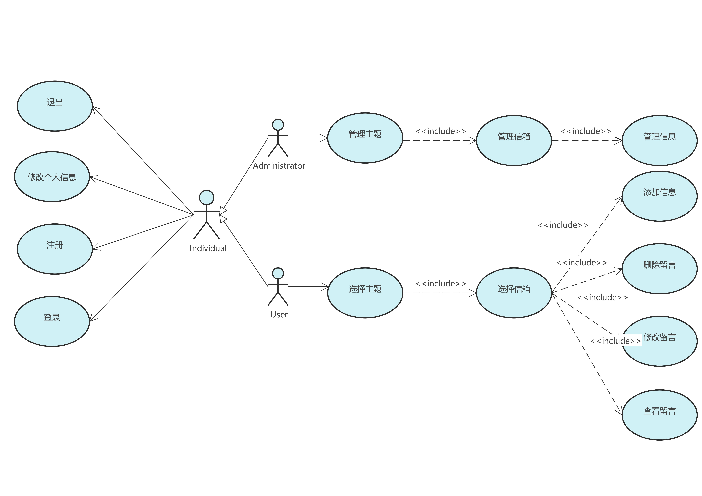
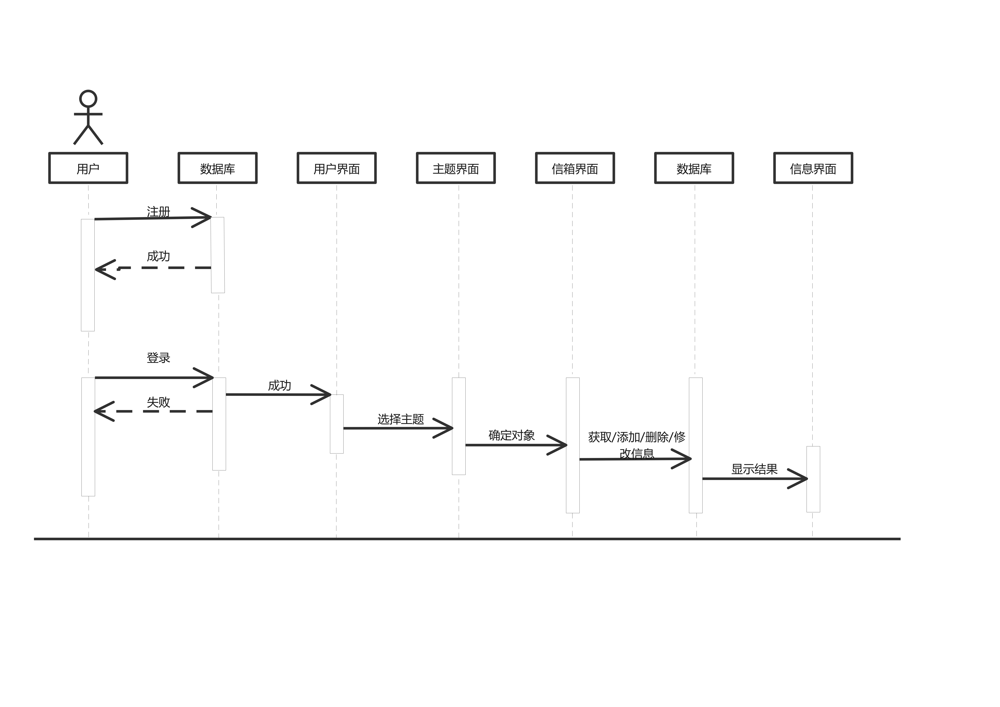

# 基于 UML 的软件分析与设计模型建模

## 毕业回忆馆

这是我们小组的 Github 网址 [https://github.com/hhazjXS/Graduation-Memories-Hall](https://github.com/hhazjXS/Graduation-Memories-Hall)

### 概述

    “毕业回忆馆”是一个集纪念、分享与回忆于一体的软件，旨在帮助用户保存和重温在学校时期的美好时光。用户可以创建时间胶囊、制作数字纪念册并在校园地图上标记重要的地点和回忆。

### 需求描述

    概述

    毕业纪念册制作工具
    描述：一个允许用户创建数字版毕业纪念册的工具，用户可以邀请同学上传照片、写留言、添加录音等，制作成一本完整的纪念册。

    校园回忆地图
    描述：一个基于地图的应用，用户可以在自己的学校地图上标记特定的地点，并附带一段回忆、照片或小故事。

1. 用户

- 注册与登录

  用户可以通过填写基本信息进行注册，并随后登录使用软件。

- 毕业留言

  用户可以记录和发布文字、照片或音频等内容，以实现毕业回忆共享。

- 校园回忆地图

  在虚拟的校园地图上，用户可以标记自己记忆中的重要地点，并附带一段回忆或照片。

2. 管理员

- 管理信息

  管理员可以对软件的信息进行增删改查的操作。

- 管理主题

  管理员可以对软件中的所有主题进行增删改操作。

- 管理用户

  管理员可以注销用户的账号。

### UML 图

### 团队贡献值

徐赛：34%

邢博闻：33%

蒋硕：33%
