# 基于 UML 的软件分析与设计模型建模

## 开发环境

- C# + .Net + Winform
- Mysql + Windows + Visual Studio 2022

## 毕业回忆馆

这是我们小组的 Github 网址 [https://github.com/hhazjXS/Graduation-Memories-Hall](https://github.com/hhazjXS/Graduation-Memories-Hall)

**（详细代码可在此网站查看）**

### 概述

    “毕业回忆馆”是一个集纪念、分享与回忆于一体的软件，旨在帮助用户保存和重温在学校时期的美好时光。用户可以创建时间胶囊、制作数字纪念册并在校园地图上标记重要的地点和回忆。

### 需求描述

    概述

    毕业纪念册制作工具
    描述：一个允许用户创建数字版毕业纪念册的工具，用户可以邀请同学上传照片、写留言、添加录音等，制作成一本完整的纪念册。

    校园回忆地图
    描述：一个基于地图的应用，用户可以在自己的学校地图上标记特定的地点，并附带一段回忆、照片或小故事。

### UML 图

### 模式与架构

单例模式 + 简单工厂模式(MVC 架构)

#### MVC 架构

- 本项目宏观上采用 MVC 架构，MVC 模式是软件工程中常见的一种软件架构模式，该模式把软件系统（项目）分为三个基本部分：模型（Model）、视图（View）和控制器（Controller）。使用 MVC 模式有很多优势，例如:简化后期对项目的修改、扩展等维护操作；使项目的某一部分变得可以重复利用；使项目的结构更加直观。

- 具体来讲，MVC 模式可以将项目划分为模型（M）、视图（V）和控制器（C）三个部分，并赋予各个部分不同的功能，方便开发人员进行分组。

  （1）视图（View）：负责界面的显示，以及与用户的交互功能，例如表单、网页等。**(在下图中对应 forms 部分)**

  （2）控制器（Controller）：可以理解为一个分发器，用来决定对于视图发来的请求，需要用哪一个模型来处理，以及处理完后需要跳回到哪一个视图。即用来连接视图和模型。**(在下图对应 service 部分)** 实际开发中，通常用控制器对客户端的请求数据进行封装（如将 form 表单发来的若干个表单字段值，封装到一个实体对象中），然后调用某一个模型来处理此请求，最后再转发请求（或重定向）到视图（或另一个控制器）。

  （3）模型（Model）：模型持有所有的数据、状态和程序逻辑。模型接受视图数据的请求，并返回最终的处理结果。**(在下图对应 Entity 部分)**

* 代码结构图

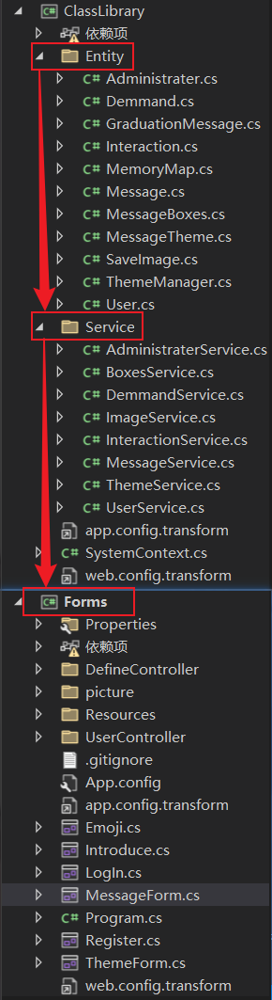

#### 简单工厂模式

- 考虑我们所设计的软件应用的场景,需要根据不同的关键字(如,毕业寄语,地图回忆等)提供多个各具特色的主题(分别适配不同的关键字),这些主题都源自于同一个基类,即主题类---MessageTheme,只不过在继承后的子类中分别装载不同的相关内容(如,MemoryMap,GraduationMessage).
  我们采取了简单工厂的模式,来利用工厂角色负责实现创建所有实例的内部逻辑,而 MessageTheme 即是抽象产品角色,是所创建的所有对象的父类,负责描述所有实例的公共接口.

- 除此之外,同时考虑到各个主题类本身(即 MemoryMap 和 GraduationMessage),在我们的具体实现方案中,恰巧又是由不同的 MessageBox 构成,在类图的指向中可以发现,这种管理逻辑和上诉的简单工厂的思想较为相似,如果考虑赋予 MessageBox 更多的可能属性,那么可以将 MessageBox 再度细分,利用上诉的思想,将其定位成 Box 抽象类,如此也可以在这一层实现简单工厂的模式,生成不同属性的 Box.

- 简单工厂模式主要应用于该项目不同主题的创建过程中.在功能设计方面,我们期望能够有一个较为统一的增加不同主题的功能接口,于是利用简单工厂模式实现根据不同的字符串(即主题名)生成不同的主题实例(如 GraduationMessage 和 MemoryMap),用以承载不同的价值需求.在该项目中,主要在 Theme 界面利用简单工厂模式实现不同主题的创建.

* 代码实现

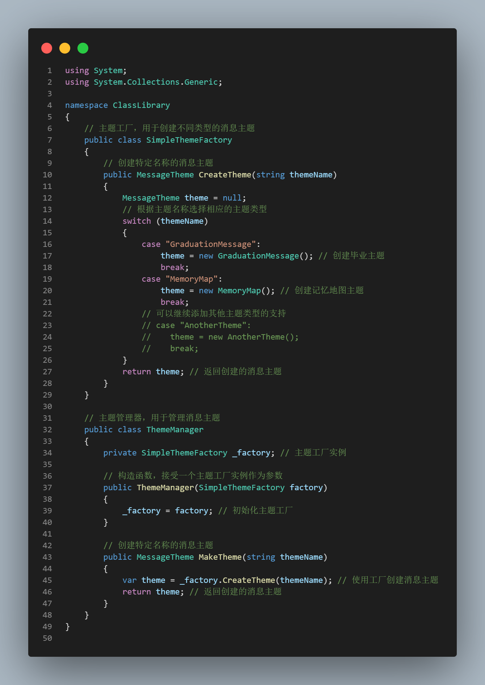
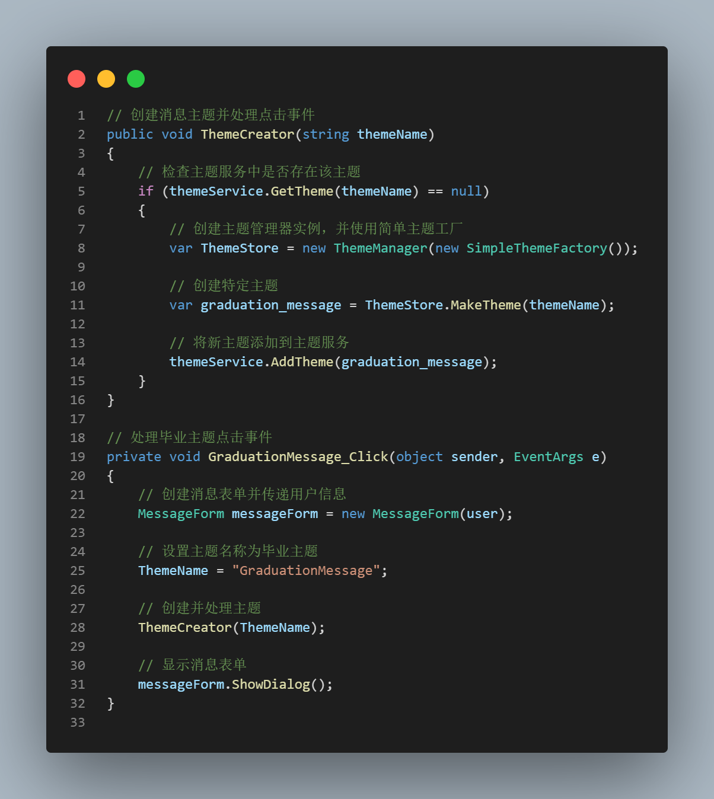

#### 单例模式

- 在该软件功能设计的实现里,数据库扮演了较为重要的角色.
  考虑到数据相关方面的考量,整个系统只需要拥有一个全局对象负责和数据库的交互,也即只允许一个数据库实例在.
  因此,在与数据库交互的过程中,我们采取了单例模式.

- 单例模式确保能够实现对相关数据库的单一访问,从而在一定程度上实现数据安全方面的考量.在该项目中,我们主要对三个数据库访问类实行单例模式,即 MessageService,BoxService,ThemeService,用于对 Message,MessageBox,MessageTheme 三者的存储,修改,访问.同时通过对数据库连接上锁,确保一定程度的线程安全.

* 代码实现

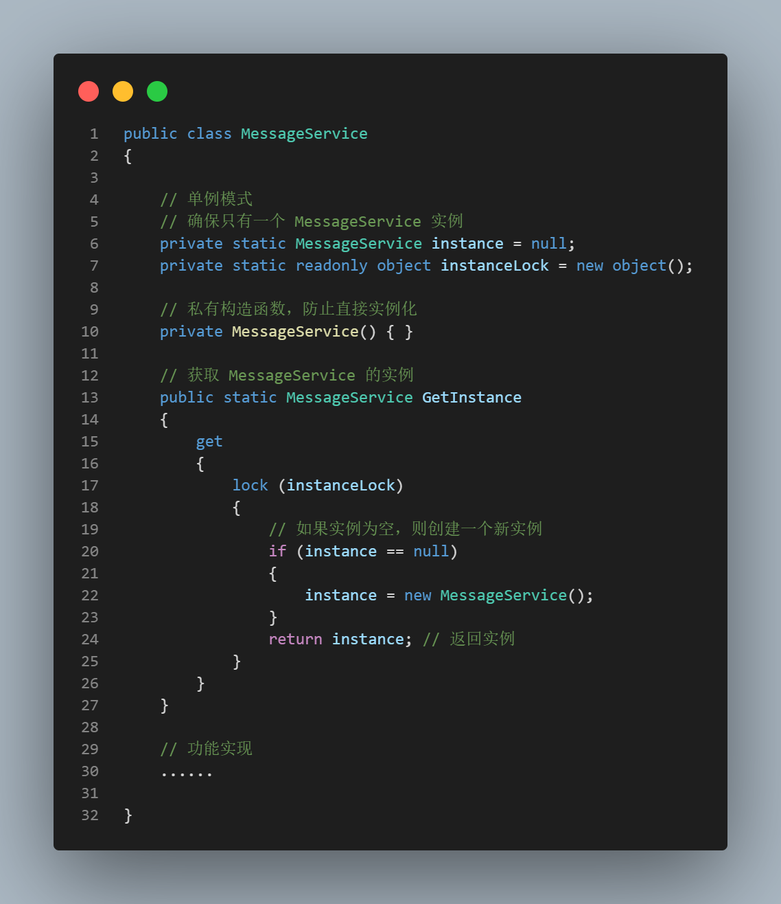
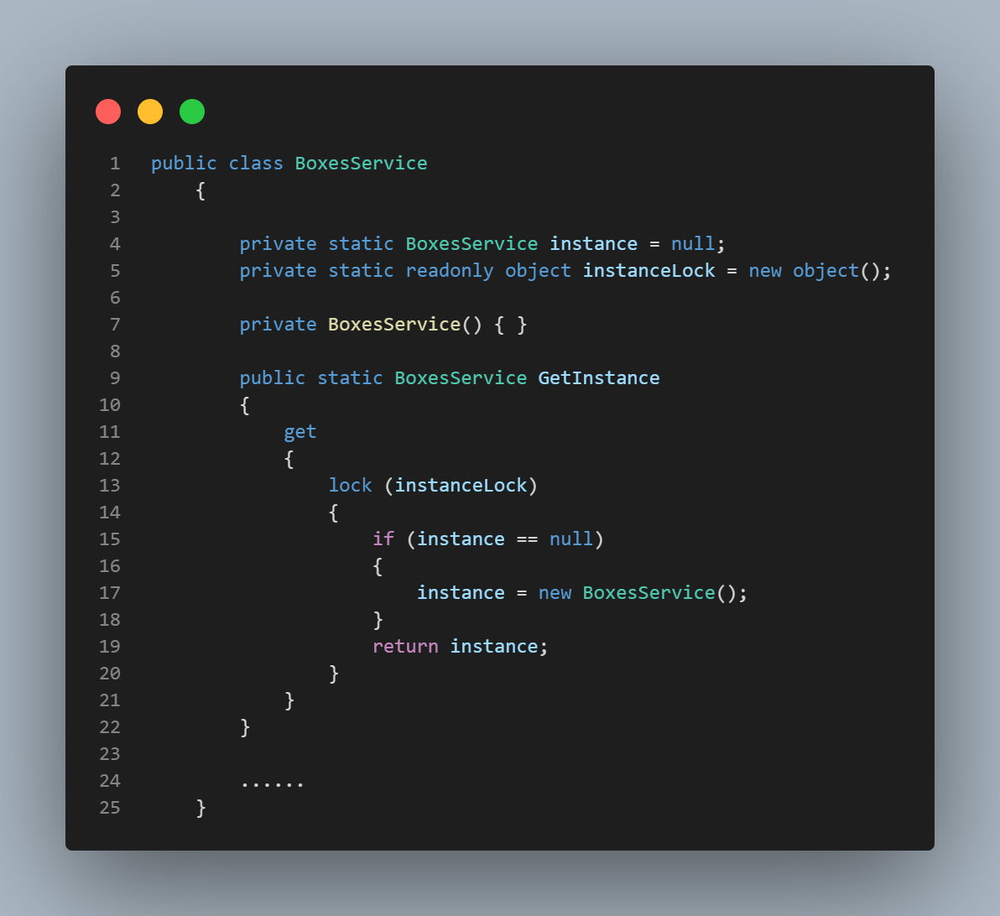
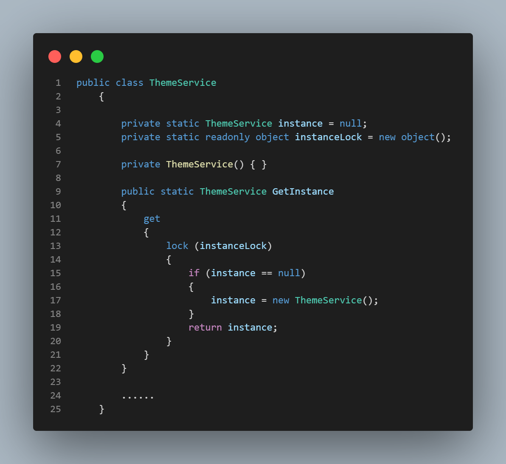

#### 运行效果图

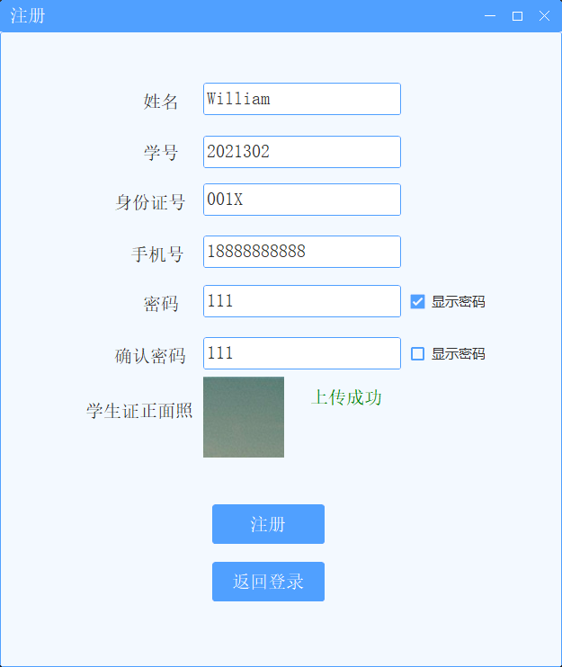
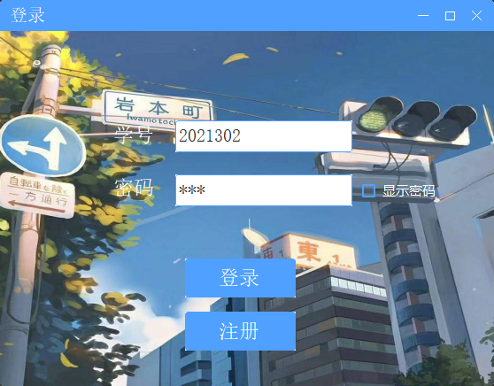
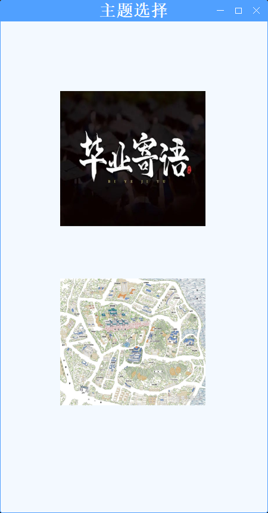
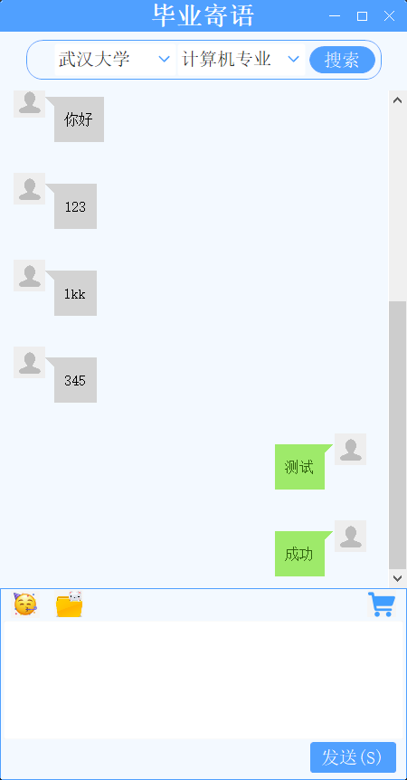
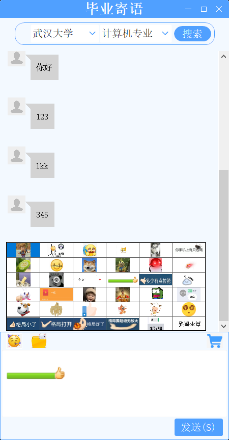

#### 团队贡献值及签名

- 贡献度

  徐 赛: 33.33%
  蒋 硕: 33.33%
  邢博闻: 33.33%

- 签名

<figure>

</figure>
